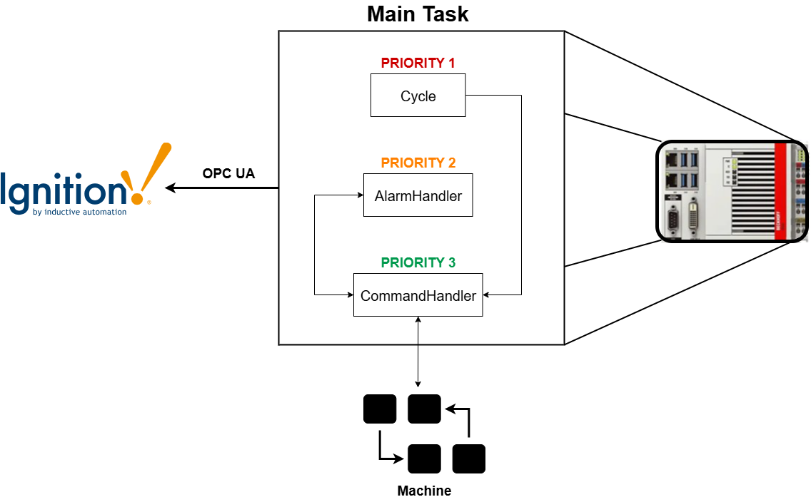

# CapCarbone

Repository for the CapCarbone final year project at the University of Sherbrooke. Includes the PLC source code inside the CapCarbone folder and the Ignition HMI project inside HMI_version folder.

## Description

This project is developped inside the Beckhoff TwinCAT3 environment and uses the Ignition platform for HMI purposes. 

- [PLC Architecture](/plc-architecture)

## Getting Started

### Dependencies

* TwinCAT3 build 4026.14
* TF6100 OPC UA Configurator
* Ignition 8.1.48 (b2025042910)
* Windows 10 or 11

### Installing

* The .zip Ignition project can be imported inside the Ignition Designer directly
* The tags.json file can be imported inside the opened Ignition project
* The Gatewway backup file can be imported inside the Ignition gateway page on the local network
* The CapCarbone.tsproj file can be opened inside the TwinCAT3 XAE Shell available with the standard TwinCAT3 install

A OPC UA server must be set up using the TF6100 Configurator tool available with the standard TwinCAT3 install. Once this is linked with the PLC project, The Ignition client can connect to it and fetch tag values. Paths to the tag values will need to be remmapped when changing environment.

## Authors

Christopher Lajoie 
lajc1503@usherbrooke.ca

Vincent Fradet
frav1401@usherbrooke.ca

## Version History

* 0.01
    * Pre-release development

## Acknowledgments

In collaboration with
* [Skyrenu](https://skyrenu.com/)